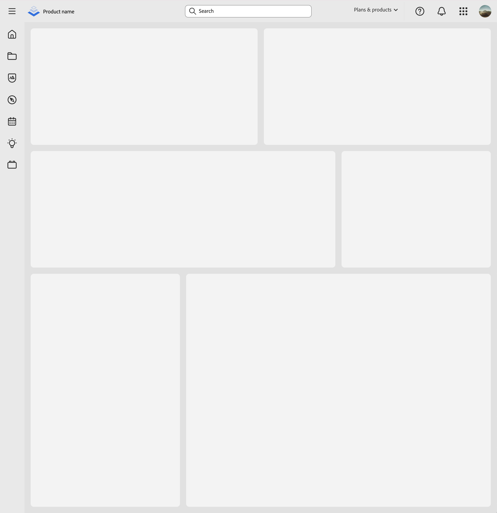

# create-swc-vite-react-app

A CLI tool to create React applications with Vite and Spectrum Web Components for fast development and build times. Now with MCP support for integration with AI assistants!

## Features

- ⚡️ Lightning fast development with Vite
- 📦 TypeScript support built-in
- ⚛️ React 19+ for the latest features
- 🎨 Spectrum Web Components integration
- 🌈 Customizable theming options
- 🔍 ESLint configuration included
- 🧩 Path aliases (@components) for clean imports
- 🎨 Beautiful default template
- 📱 Responsive design ready
- 🌙 Dark mode support
- 🤖 MCP support for integration with AI assistants

## Generated App Preview

The generated app comes with a beautiful, responsive layout that includes a header, sidebar navigation, and main content area. Here's how it looks:



The app includes (some of the items listed below are still in development):
- Modern, clean design
- Responsive layout
- Dark/Light theme support
- Customizable color schemes
- Collapsible sidebar
- Ready-to-use Spectrum components

## Quick Start

```bash
# Using npm
npx create-swc-vite-react-app my-app

# Using yarn
yarn create swc-vite-react-app my-app

# Using pnpm
pnpm create swc-vite-react-app my-app

# Create project in current directory
npx create-swc-vite-react-app .
```

## Options

- `--eslint` - Include ESLint configuration (default: true)
- `--use-npm` - Use npm as package manager
- `--use-pnpm` - Use pnpm as package manager
- `--use-yarn` - Use yarn as package manager
- `--theme-scale` - Theme scale: large, medium, or both (default: both)
- `--theme-color` - Theme color: dark, light, or both (default: both)
- `--system` - Design system: spectrum, spectrum-two, or express (default: spectrum)
- `--mcp` - Start in MCP mode for integration with AI assistants

Note: The SpTheme.ts file will be customized with the appropriate imports based on your theme selections.

## Project Structure

The generated project will have the following structure:

```
my-app/
├── node_modules/
├── public/
├── src/
│   ├── components/
│   │   ├── icons/
│   │   │   └── [icon components]
│   │   ├── Accordion.ts
│   │   ├── ActionBar.ts
│   │   ├── ActionButton.ts
│   │   ├── ActionGroup.ts
│   │   ├── ActionMenu.ts
│   │   ├── AlertBanner.ts
│   │   ├── AlertDialog.ts
│   │   ├── Button.ts
│   │   ├── Card.ts
│   │   ├── Checkbox.ts
│   │   ├── Dialog.ts
│   │   ├── Icon.ts
│   │   ├── SpTheme.ts (imports customized based on theme options)
│   │   ├── Toast.ts
│   │   ├── Tooltip.ts
│   │   ├── types.ts
│   │   └── [60+ components in total]
│   ├── layout/
│   │   ├── Header.tsx
│   │   ├── Header.css
│   │   ├── Sidebar.tsx
│   │   ├── Sidebar.css
│   │   ├── MainContent.tsx
│   │   └── MainContent.css
│   ├── App.tsx
│   ├── App.css
│   └── main.tsx
├── .eslintrc.cjs
├── index.html
├── package.json
├── tsconfig.json
├── tsconfig.node.json
└── vite.config.ts
```

The project includes:

- **components/**: A comprehensive set of Spectrum Web Components wrappers
  - **icons/**: SVG icon components
  - Various UI components (60+ components available)
  - `SpTheme.ts`: Theme configuration (customized based on your options)
  - `types.ts`: TypeScript type definitions
- **layout/**: Pre-built layout components
  - `Header`: Application header with navigation
  - `Sidebar`: Collapsible side navigation
  - `MainContent`: Main content area with responsive design
- **App.tsx**: Main application component
- **Configuration files**: ESLint, TypeScript, and Vite configs

## Available Scripts

In the project directory, you can run:

- `npm dev` - Starts the development server
- `npm build` - Bundles the app for production
- `npm preview` - Preview the production build locally
- `npm lint` - Run ESLint to check code quality

## MCP Support

This tool now includes MCP (Model Context Protocol) mode support.

### MCP Features

- **Tools**: The MCP server exposes a `create-app` tool that can create a new project with the same options as the CLI.
- **Prompts**: The MCP server includes a prompt for guiding users through creating a new project.
- **Resources**: Documentation for CLI options is available as a resource.

### Integration with Cursor

To integrate with Cursor, you can configure it to use this tool with the MCP protocol. This allows Cursor's AI assistant to directly create SWC+Vite React applications based on user instructions.

```json
{
  "mcpServers": {
    "create-swc-vite-react-app": {
      "command": "npx",
      "args": ["-y", "create-swc-vite-react-app@latest", "--mcp"],
      "env": {}
    }
  }
}
```

## Requirements

- Node.js 18.0.0 or later
- npm 7.0.0 or later, yarn 1.22.0 or later, or pnpm 7.0.0 or later

## Dependencies

Key dependencies:
- @modelcontextprotocol/sdk: ^1.8.0
- chalk: ^5.4.1
- commander: ^13.1.0
- fs-extra: ^11.3.0
- prompts: ^2.4.2
- validate-npm-package-name: ^6.0.0

## License

MIT 
